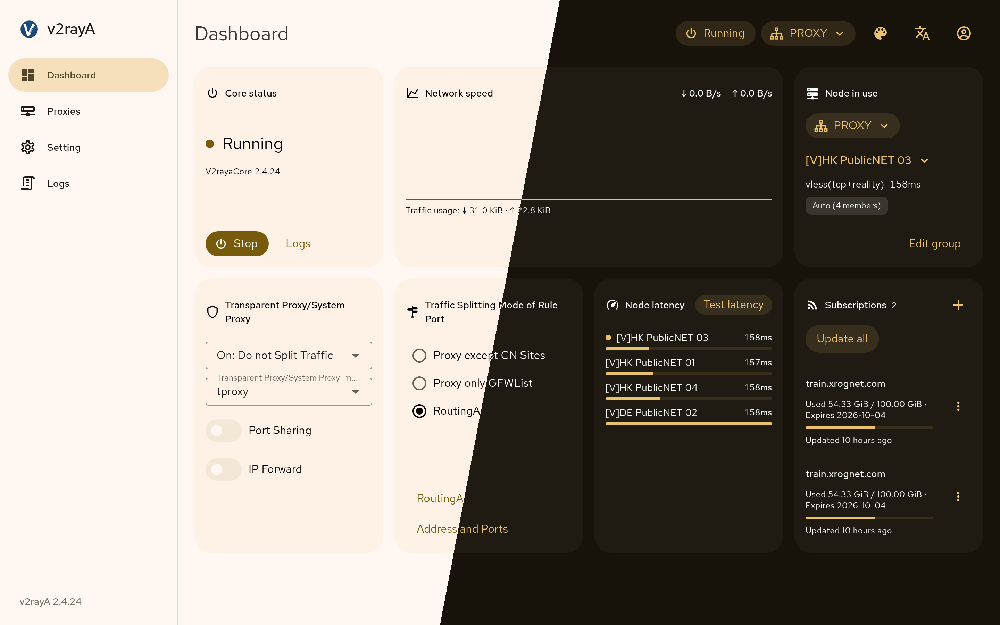
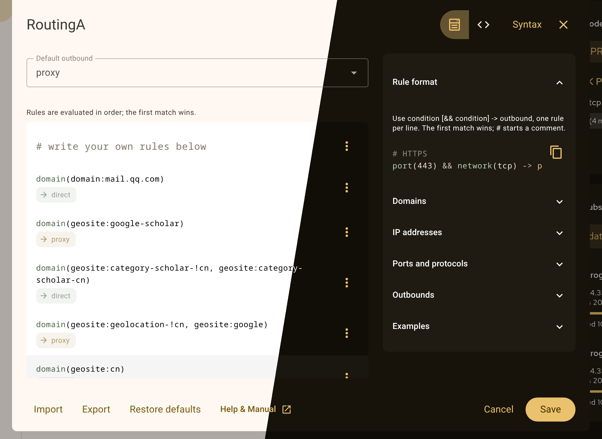

# v2rayA  

[**English**](https://github.com/v2rayA/v2rayA/blob/main/README.md)&nbsp;&nbsp;&nbsp;[**简体中文**](https://github.com/v2rayA/v2rayA/blob/main/README_zh.md)&nbsp;&nbsp;&nbsp;[**Русский**](https://github.com/v2rayA/v2rayA/blob/main/README_ru.md)

v2rayA is a web client for its own Xray-based core with global transparent proxy on Linux, Windows and macOS. It speaks VMess, VLESS, Shadowsocks, Trojan, Hysteria2, TUIC, [Juicity](https://github.com/juicity), AnyTLS, WireGuard, SOCKS5 and HTTP(S) proxy links; ShadowsocksR is no longer supported.

We are committed to providing the simplest operation and meet most needs.

Thanks to the advantages of Web GUI, you can not only use it on your local computer, but also easily deploy it on a router or NAS.

Project：https://github.com/v2rayA/v2rayA

## Usage

v2rayA mainly provides the following methods of installation:

1. Install from apt-source or AUR
2. Docker
3. Our self-built [scoop bucket](https://github.com/v2rayA/v2raya-scoop) (for Windows users)
4. Our self-built [homebrew tap](https://github.com/v2rayA/homebrew-v2raya)
5. Our self-built [OpenWrt repo](https://github.com/v2rayA/v2raya-openwrt) and OpenWrt's official repo(from OpenWrt version 22.03)
6. Microsoft winget: https://winstall.app/apps/v2rayA.v2rayA
7. Ubuntu Snap: https://snapcraft.io/v2raya
8. Binary file and installation package from GitHub releases

See [**v2rayA - Docs**](https://v2raya.org/en/docs/prologue/introduction/)

## Transparent proxy

On Linux, transparent proxy is available as `redirect`, `tproxy` or `tun`; on Windows and macOS as `tun` or the system proxy.

`tun` is built into the core: the core opens a TUN device, assigns its address and takes the default route. Its own connections, the direct outbound and the DNS module's upstream queries never enter the TUN (by socket mark on Linux, by binding to the physical interface on Windows and macOS), and every DNS query an application sends to a public resolver is answered by the core's DNS module. v2rayA and the core are always excluded; other processes can be excluded by executable name in the settings. Connected and static routes always bypass the TUN.

Known limitation: on Windows and macOS an application that queries a LAN resolver directly still bypasses the TUN. The system resolver is pointed at the TUN and is covered.

## Screenshots

The dashboard: the core, the node in use, live traffic, the transparent proxy and splitting modes, the members' latency and the subscriptions, each a tile.

The RoutingA editor: rules as a list with a rule editor, or as text with line numbers, colouring and per-line checks; the syntax at hand; import and export.

## Statement

1. The program does not store any user data in the cloud, and all user data is stored in local.
2. **Do not use this project for illegal purposes.**

## Credits

[hq450/fancyss](https://github.com/hq450/fancyss)

[ToutyRater/v2ray-guide](https://github.com/ToutyRater/v2ray-guide/blob/master/routing/sitedata.md)

[nadoo/glider](https://github.com/nadoo/glider)

[Loyalsoldier/v2ray-rules-dat](https://github.com/Loyalsoldier/v2ray-rules-dat)

[zfl9/ss-tproxy](https://github.com/zfl9/ss-tproxy/blob/master/ss-tproxy)

## Stargazers over time

## License

