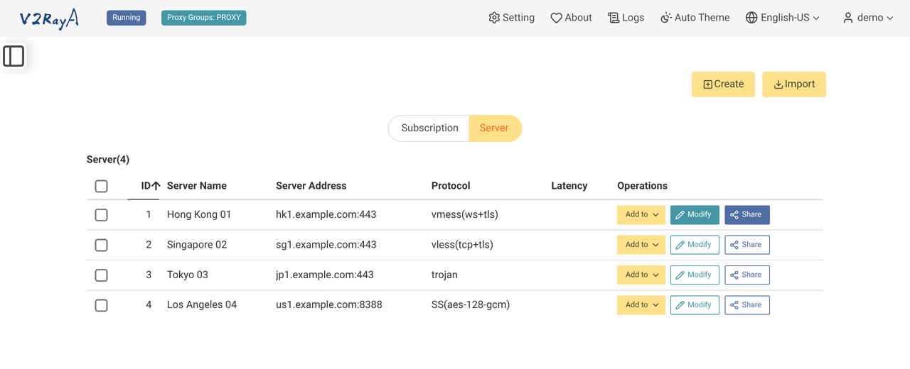

# v2rayA  

[**English**](https://github.com/v2rayA/v2rayA/blob/main/README.md)&nbsp;&nbsp;&nbsp;[**简体中文**](https://github.com/v2rayA/v2rayA/blob/main/README_zh.md)

v2rayA 是一个在 Linux、Windows、macOS 上支持全局透明代理的 V2Ray 客户端，同时兼容 SS、SSR、Trojan(trojan-go)、Tuic 与 [Juicity](https://github.com/juicity)协议。 [[SSR支持清单]](https://github.com/v2rayA/dist/shadowsocksR/blob/master/README.md#ss-encrypting-algorithm)

v2rayA 致力于提供最简单的操作，满足绝大部分需求。

得益于 Web 客户端的优势，你不仅可以将其用于本地计算机，还可以轻松地将它部署在路由器或 NAS 上。

项目地址：https://github.com/v2rayA/v2rayA

## 使用方法

v2rayA 主要提供了下述使用方法：

1. 从 APT 软件源或者 AUR 安装
2. Docker
3. 自建 [scoop bucket](https://github.com/v2rayA/v2raya-scoop) (Windows 用户)
4. 自建 [homebrew tap](https://github.com/v2rayA/homebrew-v2raya)
5. 自建 [OpenWrt 仓库](https://github.com/v2rayA/v2raya-openwrt) 和 OpenWrt 官方软件源（从 OpenWrt 22.03 版本开始提供）
6. 微软 winget: https://winstall.app/apps/v2rayA.v2rayA
7. Ubuntu Snap: https://snapcraft.io/v2raya
8. 从 GitHub releases 下载二进制与安装包

详见 [**v2rayA - Docs**](https://v2raya.org/docs/prologue/introduction/)

## 透明代理

Linux 上透明代理有 `redirect`、`tproxy`、`tun` 三种；Windows 与 macOS 上有 `tun` 与系统代理。

`tun` 内建在核心里：核心打开 TUN 设备、配置地址并接管默认路由。核心自己的连接、direct 出站与 DNS 模块的上游查询不会进入 TUN（Linux 靠 socket 标记，Windows 与 macOS 靠绑定物理网卡）；应用发往公网 DNS 的查询由核心的 DNS 模块回答。v2rayA 与核心始终被排除，其他进程可在设置里按可执行文件名排除。直连路由与静态路由始终不经过 TUN。

已知限制：Windows 与 macOS 上直接向局域网 DNS 查询的应用仍会绕过 TUN；系统解析器指向 TUN，不受影响。

## 界面截图

<picture>
  <source media="(prefers-color-scheme: dark)" srcset="docs/images/screenshot-dark.png">
  
</picture>

## 注意

1. 程序不会将任何用户数据保存在云端，所有用户数据存放在用户本地配置文件中。

2. **不要将本项目用于不合法用途。**

## 感谢

[hq450/fancyss](https://github.com/hq450/fancyss)

[ToutyRater/v2ray-guide](https://github.com/ToutyRater/v2ray-guide/blob/master/routing/sitedata.md)

[nadoo/glider](https://github.com/nadoo/glider)

[Loyalsoldier/v2ray-rules-dat](https://github.com/Loyalsoldier/v2ray-rules-dat)

[zfl9/ss-tproxy](https://github.com/zfl9/ss-tproxy/blob/master/ss-tproxy)

## 协议

